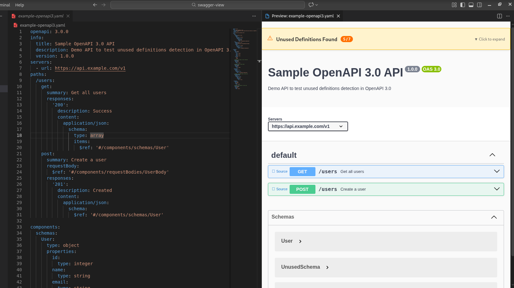
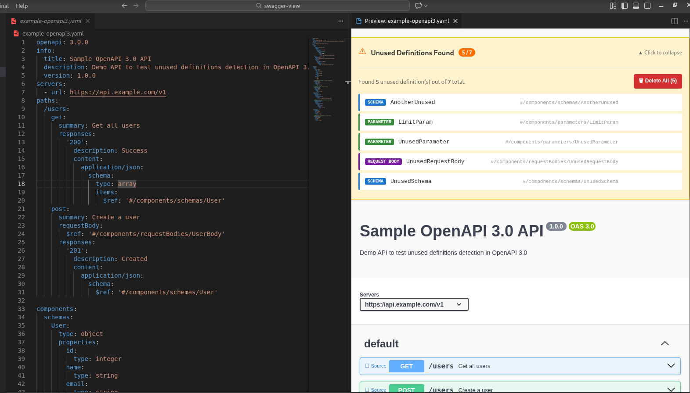
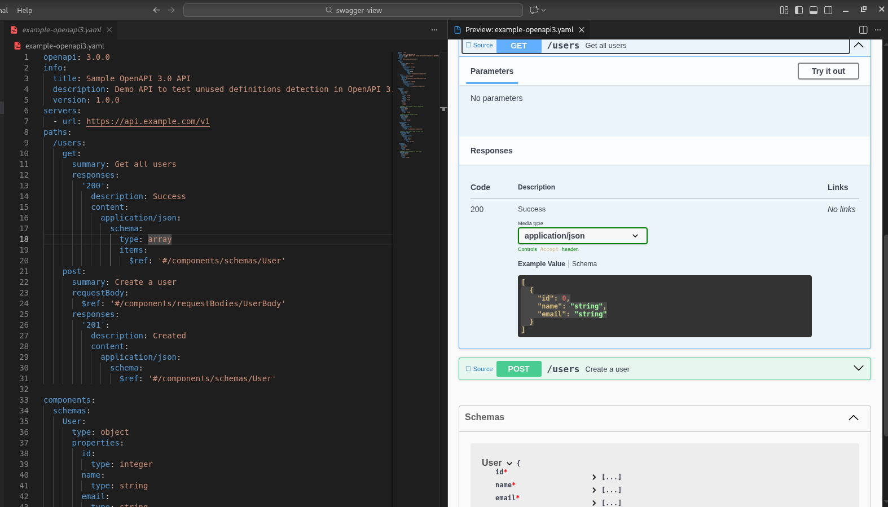

# Swagger Preview

A Visual Studio Code extension to preview Swagger/OpenAPI specification files with an embedded Swagger UI and powerful unused definitions management.

## Features

- 🚀 **Preview Swagger 2.0 and OpenAPI 3.x** specifications with embedded Swagger UI
- 📝 **Support for both YAML and JSON** formats
- 🔄 **Real-time preview updates** as you edit your specification
- 🎨 **Clean, integrated Swagger UI** interface
- ⚡ **Quick access** from editor toolbar, context menu, and command palette

### 🔍 Unused Definitions Detection

Automatically identifies definitions, schemas, parameters, responses, and other components that are declared but never referenced:

- **Visual Banner** - Shows count of unused vs total definitions
- **Color-coded Badges** - Different colors for each component type
- **Expandable List** - View all unused items with their paths

### 🎯 Click to Navigate

Click on any unused definition in the preview to **instantly jump to its location** in the editor:

- Cursor moves to the definition declaration
- Editor scrolls to center the definition on screen
- Works for all component types (definitions, parameters, responses, etc.)

### 📍 Navigate to API Path Source

Each API endpoint in the Swagger UI preview has a **"📍 Source"** button:

- Click to jump directly to that path's definition in the editor
- Navigates to the specific HTTP method (GET, POST, etc.)
- Works with all endpoints in your specification

### 🗑️ Delete Unused Definitions

Remove unused definitions directly from the preview:

- **Delete Individual** - Click the delete button next to any unused definition
- **Delete All** - Remove all unused definitions at once with one click
- **Confirmation Dialog** - Always asks before deleting to prevent accidents
- **Smart Deletion** - Automatically removes associated comments (like `# UNUSED:`)

## Screenshots







## Build and load extension
As of now there is no official publisher extension id or url that we have from which user can search in vscode extension marketplace and download it.

Because of which user is required to follow below steps to generate vsix file and then load it manually in extensions bar to load this extension

### steps

#### Requirements
> Just make sure that nodejs is installed in your system - for download please visit https://nodejs.org/en this website

#### Build steps
1. Download vsce npm package
   ```shell
   npm install @vscode/vsce #if you want to install globally then add "-g" flag at the end
   ```
2. clone this repo
   ```shell
   git clone https://github.com/WeDontTrack/swagger-view --branch master
   ```
3. install all dependencies
   ```shell
   cd swagger-view
   npm install
   ```
4. Build vsix file by running below command
   ```shell
   vsce package --baseContentUrl https://localhost --baseImagesUrl https://localhost"  #and enter y to all input requests
   ```
5. Now there will be vsix file generated in the folder
6. Drag this vsix file to the extension bar in the vscode - And boom - extension is ready to use.
   

## Usage

### Opening the Preview

There are several ways to open the Swagger preview:

1. **Editor Toolbar**: Open a `.yaml` or `.json` file and click the preview icon in the editor toolbar
2. **Context Menu**: Right-click in a YAML or JSON file and select "Preview Swagger"
3. **Command Palette**: Press `Cmd+Shift+P` (Mac) or `Ctrl+Shift+P` (Windows/Linux) and type "Preview Swagger"

### Live Updates

The preview automatically updates as you edit your specification file. No need to manually refresh!

### Managing Unused Definitions

1. **Expand the Banner** - Click on the banner header to see the list of unused definitions
2. **Navigate to Definition** - Click on any item to jump to its location in the editor
3. **Delete Single Definition** - Click the 🗑 Delete button next to any item
4. **Delete All at Once** - Click the red "🗑 Delete All" button to remove all unused definitions

## Detected Component Types

### Swagger 2.0
| Component | Path | Badge Color |
|-----------|------|-------------|
| Definitions | `#/definitions/*` | Blue |
| Parameters | `#/parameters/*` | Green |
| Responses | `#/responses/*` | Orange |

### OpenAPI 3.x
| Component | Path | Badge Color |
|-----------|------|-------------|
| Schemas | `#/components/schemas/*` | Blue |
| Parameters | `#/components/parameters/*` | Green |
| Responses | `#/components/responses/*` | Orange |
| Request Bodies | `#/components/requestBodies/*` | Purple |
| Headers | `#/components/headers/*` | Cyan |

## Supported Formats

- Swagger 2.0 (JSON/YAML)
- OpenAPI 3.0.x (JSON/YAML)
- OpenAPI 3.1.x (JSON/YAML)

## Requirements

- Visual Studio Code version 1.75.0 or higher

## Example Files

The project includes example Swagger/OpenAPI files for testing:

| File | Description |
|------|-------------|
| `example-with-unused.yaml` | Swagger 2.0 spec with 4 unused definitions |
| `example-openapi3.yaml` | OpenAPI 3.0 spec with unused schemas |
| `example-clean.yaml` | Clean spec with no unused definitions |

Open any of these files in VS Code and use the preview command to see the features in action!

## Development

### Setup

```bash
git clone https://github.com/WeDontTrack/swagger-view --branch master
cd /swagger-preview
npm install
```

### Build

```bash
npm run compile
```

### Run in Development

1. Open this project in VS Code
2. Press `F5` to open a new window with the extension loaded
3. Open a Swagger/OpenAPI file (try `example-with-unused.yaml`)
4. Use the preview command to test

### Watch Mode

```bash
npm run watch
```

### Test the Analyzer

```bash
node test-analyzer.js
```

## Extension Commands

| Command | Description |
|---------|-------------|
| `swagger-preview.preview` | Preview Swagger - Opens the Swagger UI preview for the current file |

## Known Issues

None at this time. Please report issues on the GitHub repository.

## Release Notes

### 0.0.9 (Current)

SOLID Principles Refactoring:
- 🏗️ **Single Responsibility Principle (SRP)** - Each class has one responsibility
  - `CacheManager` - Handles caching logic
  - `NavigationService` - Handles navigation to definitions/paths
  - `DefinitionService` - Handles finding and deleting definitions
  - `SpecParser` - Handles YAML/JSON parsing
  - `SpecAnalyzer` - Handles spec analysis only
- 🔌 **Open/Closed Principle (OCP)** - Strategy pattern for definition collectors
- 📋 **Interface Segregation (ISP)** - Focused interfaces for each service
- 🔄 **Dependency Inversion (DIP)** - Services depend on abstractions
- ✅ **Performance maintained** - All optimizations preserved

### 0.0.8

Code organization:
- 📁 Moved all types to `types.ts`
- 📁 Moved all constants to `constants.ts`
- 📁 Created `utils.ts` for utility functions
- 🧹 Cleaner imports and better separation of concerns

### 0.0.7

Performance optimizations:
- ⚡ **Debounced Updates** - 400ms debounce prevents excessive updates during typing
- 🗄️ **Cached Analysis** - MD5 hash-based caching for spec analysis results
- 📨 **Incremental Updates** - Uses postMessage for faster webview updates
- 🔄 **Skip Redundant Updates** - Content hash comparison prevents duplicate processing
- 🧹 **Automatic Cache Cleanup** - LRU cache with 5-minute TTL and max 10 entries

### 0.0.6

All features:
- 🚀 **Swagger UI Preview** - Embedded Swagger UI for YAML and JSON specs
- 🔄 **Real-time Updates** - Preview updates automatically as you edit
- 🔍 **Unused Definitions Detection** - Identifies unused components in your spec
- 🎯 **Click to Navigate** - Click on unused definitions to jump to their location
- 📍 **Navigate to API Source** - Click "📍 Source" button on any endpoint to jump to its definition
- 🗑️ **Delete Individual** - Remove single unused definitions with confirmation
- 🗑️ **Delete All** - Remove all unused definitions at once
- 📊 **Color-coded Badges** - Visual indicators for different component types
- 📋 **Expandable Banner** - Collapsible list of all unused items
- 🧹 **Smart Deletion** - Automatically removes associated comments
- ⚡ **Batch Operations** - Delete all uses bottom-to-top strategy for reliability

## Technical Details

### How Unused Detection Works

1. **Collect Definitions** - Scans all definition sections (definitions, components, parameters, etc.)
2. **Find References** - Recursively searches for all `$ref` references in the spec
3. **Compare** - Items defined but not referenced are marked as unused
4. **Display** - Results shown in the preview banner with interactive controls

### Deletion Strategy

- Definitions are deleted from **bottom to top** to prevent line number shifting
- All deletions in "Delete All" happen in a **single editor transaction**
- Associated comments (`# UNUSED:`) are automatically detected and removed

## License

GNU GENERAL PUBLIC LICENSE  Version 3

---

## Reach - out
For any queries/suggestions/bug fixes - please raise issue on https://github.com/WeDontTrack/swagger-view repo

**Enjoy keeping your API specifications _clean and private_!** 

